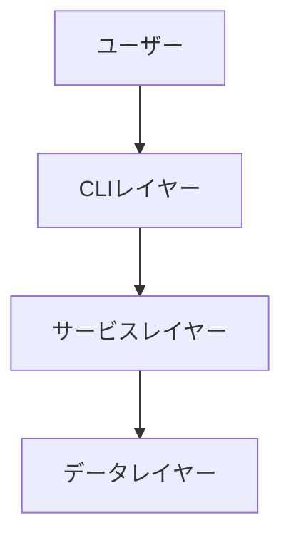
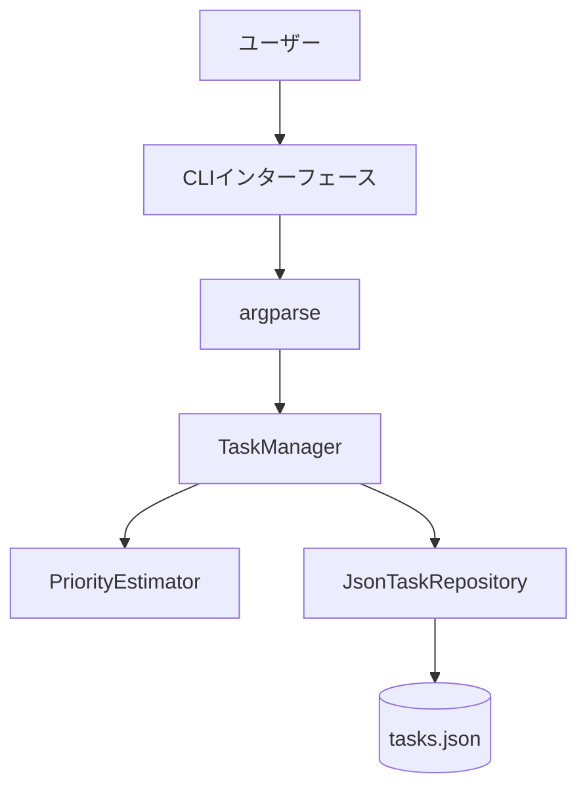
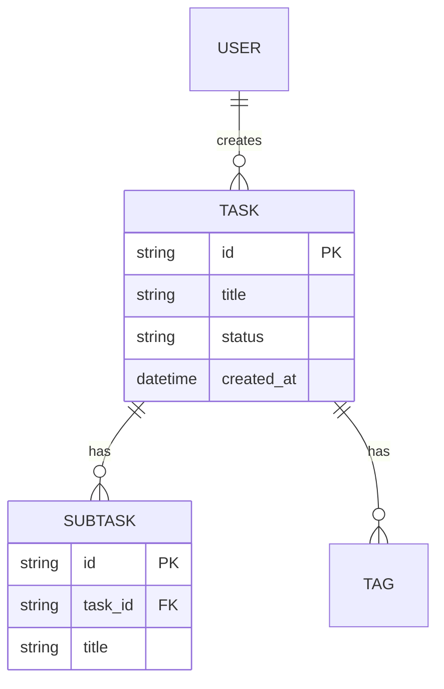
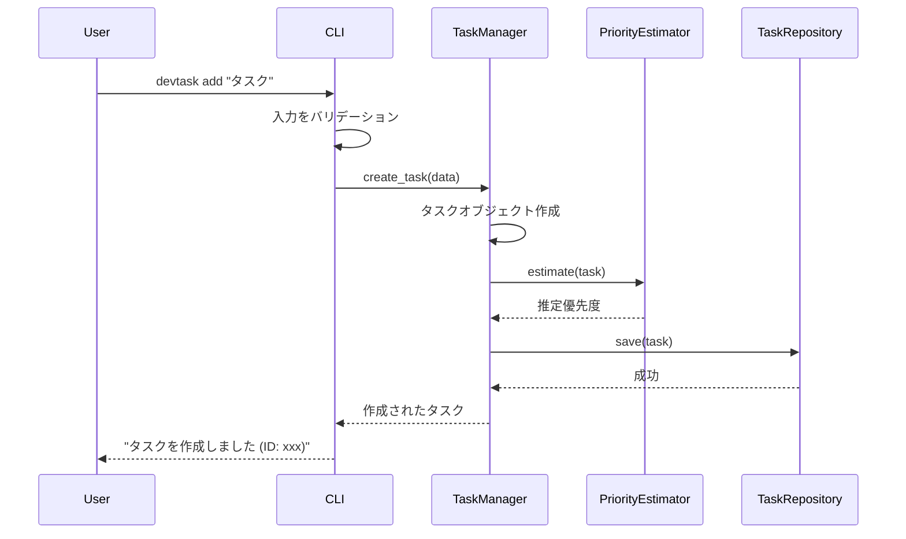

# 機能設計書作成ガイド

このガイドは、プロダクト要求定義書(PRD)に基づいて機能設計書を作成するための実践的な指針を提供します。

## 機能設計書の目的

機能設計書は、PRDで定義された「何を作るか」を「どう実現するか」に落とし込むドキュメントです。

**主な内容**:
- システム構成図
- データモデル
- コンポーネント設計
- アルゴリズム設計（該当する場合）
- UI設計
- エラーハンドリング

## 作成の基本フロー

### ステップ1: PRDの確認

機能設計書を作成する前に、必ずPRDを確認します。

```
Claude CodeにPRDから機能設計書を作成してもらう際のプロンプト例:

PRDの内容に基づいて機能設計書を作成してください。
特に優先度P0(MVP)の機能に焦点を当ててください。
```

### ステップ2: システム構成図の作成

#### Mermaid記法の使用

システム構成図はMermaid記法で記述します。

**基本的な3層アーキテクチャの例**:


**より詳細な例**:


### ステップ3: データモデル定義

#### Python型定義で明確に

データモデルはPythonの型定義（dataclass / Enum）で定義します。ドメインモデルの実装パターン（エンティティ・値オブジェクト・集約）は `.claude/guides/ddd.md` に従います。

**基本的なTask型の例**:
```python
from dataclasses import dataclass, field
from datetime import datetime
from enum import Enum
from uuid import UUID, uuid4


class TaskStatus(Enum):
    TODO = "todo"
    IN_PROGRESS = "in_progress"
    COMPLETED = "completed"


class TaskPriority(Enum):
    HIGH = "high"
    MEDIUM = "medium"
    LOW = "low"


@dataclass(frozen=True)
class StatusChange:
    """ステータス変更履歴（値オブジェクト）"""
    from_status: TaskStatus                # 変更前ステータス
    to_status: TaskStatus                  # 変更後ステータス
    changed_at: datetime                   # 変更日時


@dataclass
class Task:
    """タスク（エンティティ・集約ルート）"""
    title: str                                        # 1-200文字
    status: TaskStatus                                # 未着手 / 進行中 / 完了
    priority: TaskPriority                            # 高 / 中 / 低
    created_at: datetime                              # 作成日時
    updated_at: datetime                              # 更新日時
    id: UUID = field(default_factory=uuid4)           # UUID v4
    description: str | None = None                    # オプション、Markdown形式
    estimated_priority: TaskPriority | None = None    # 自動推定された優先度
    due_date: datetime | None = None                  # 期限
    status_history: list[StatusChange] = field(default_factory=list)  # ステータス変更履歴
```

**重要なポイント**:
- 各フィールドにコメントで説明を追加
- 制約（文字数、形式など）を明記し、生成時バリデーションは `__post_init__` で行う
- オプションフィールドは `X | None = None` で定義する
- 選択肢が固定の値は `Enum` で定義して可読性と安全性を向上
- エンティティは `@dataclass`、値オブジェクトは `@dataclass(frozen=True)`、IDは `UUID` 型で実装する（ddd.md参照）

#### ER図の作成

複数のエンティティがある場合、ER図で関連を示します。



### ステップ4: コンポーネント設計

各レイヤーの責務を明確にします。

#### CLIレイヤー

**責務**: ユーザー入力の受付、バリデーション（形式）、結果の表示

```python
# プレゼンテーション層: CommandLineInterface
class CLI:
    def parse_arguments(self) -> Command:
        """ユーザー入力を受け付ける"""

    def display_result(self, result: Result) -> None:
        """結果を表示する"""

    def display_error(self, error: Exception) -> None:
        """エラーを表示する"""
```

#### サービスレイヤー

**責務**: ユースケースの手順調整（ビジネスルールはドメインモデル側に置く）

```python
# アプリケーション層: TaskManager
class TaskManager:
    def __init__(self, task_repository: TaskRepository) -> None:
        self._task_repository = task_repository

    def create_task(self, data: CreateTaskData) -> Task:
        """タスクを作成する"""

    def list_tasks(self, filter_options: FilterOptions | None = None) -> list[Task]:
        """タスク一覧を取得する"""

    def update_task(self, task_id: UUID, data: UpdateTaskData) -> Task:
        """タスクを更新する"""

    def delete_task(self, task_id: UUID) -> None:
        """タスクを削除する"""
```

#### データレイヤー

**責務**: データの永続化と取得（リポジトリパターン。インターフェースはドメイン層、実装はインフラ層）

```python
# ドメイン層: リポジトリインターフェース（抽象）
from abc import ABC, abstractmethod

class TaskRepository(ABC):
    @abstractmethod
    def find_by_id(self, task_id: UUID) -> Task | None:
        """IDでタスクを取得する"""

    @abstractmethod
    def find_all(self) -> list[Task]:
        """全タスクを取得する"""

    @abstractmethod
    def save(self, task: Task) -> None:
        """タスクを保存する"""

    @abstractmethod
    def delete(self, task_id: UUID) -> None:
        """タスクを削除する"""


# インフラ層: リポジトリ実装
class JsonTaskRepository(TaskRepository):
    """JSONファイルによる実装（技術詳細はここに閉じ込める）"""
```

### ステップ5: アルゴリズム設計（該当する場合）

複雑なロジック（例: 優先度自動推定）は詳細に設計します。

#### 優先度自動推定アルゴリズムの例

**目的**: タスクの期限、作成日時、ステータスから優先度を自動推定

**計算ロジック**:

##### ステップ1: 期限スコア計算（0-100点）
```
- 期限超過: 100点（最高）
- 期限まで0-3日: 90点
- 期限まで4-7日: 70点
- 期限まで8-14日: 50点
- 期限まで14日以上: 30点
- 期限設定なし: 20点
```

**計算式**:
```python
def calculate_deadline_score(due_date: datetime | None) -> int:
    if due_date is None:
        return 20

    days_remaining = (due_date - datetime.now()).days

    if days_remaining < 0:
        return 100  # 期限超過
    if days_remaining <= 3:
        return 90
    if days_remaining <= 7:
        return 70
    if days_remaining <= 14:
        return 50
    return 30
```

##### ステップ2: 経過時間スコア計算（0-100点）
```
- 作成から30日以上: 100点（最高）
- 作成から21-30日: 80点
- 作成から14-21日: 60点
- 作成から7-14日: 40点
- 作成から7日未満: 20点
```

**計算式**:
```python
def calculate_age_score(created_at: datetime) -> int:
    days_old = (datetime.now() - created_at).days

    if days_old >= 30:
        return 100
    if days_old >= 21:
        return 80
    if days_old >= 14:
        return 60
    if days_old >= 7:
        return 40
    return 20
```

##### ステップ3: ステータススコア計算（0-100点）
```
- 進行中 (in_progress): 100点（最高優先）
- 未着手 (todo): 50点
- 完了 (completed): 0点
```

**計算式**:
```python
def calculate_status_score(status: TaskStatus) -> int:
    if status is TaskStatus.IN_PROGRESS:
        return 100
    if status is TaskStatus.TODO:
        return 50
    return 0  # COMPLETED
```

##### ステップ4: 総合スコア計算

**加重平均**:
```
総合スコア = (期限スコア × 50%) + (経過時間スコア × 20%) + (ステータススコア × 30%)
```

**計算式**:
```python
def calculate_total_score(task: Task) -> float:
    deadline_score = calculate_deadline_score(task.due_date)
    age_score = calculate_age_score(task.created_at)
    status_score = calculate_status_score(task.status)

    return (deadline_score * 0.5) + (age_score * 0.2) + (status_score * 0.3)
```

##### ステップ5: 優先度分類

**閾値による分類**:
```
- 70点以上: high（高優先度）
- 40-70点: medium（中優先度）
- 40点未満: low（低優先度）
```

**計算式**:
```python
def estimate_priority(task: Task) -> TaskPriority:
    score = calculate_total_score(task)

    if score >= 70:
        return TaskPriority.HIGH
    if score >= 40:
        return TaskPriority.MEDIUM
    return TaskPriority.LOW
```

**完全な実装例**:
```python
class PriorityEstimator:
    """優先度自動推定（ドメインサービス）"""

    def estimate(self, task: Task) -> TaskPriority:
        deadline_score = self._calculate_deadline_score(task.due_date)
        age_score = self._calculate_age_score(task.created_at)
        status_score = self._calculate_status_score(task.status)

        total_score = (deadline_score * 0.5) + (age_score * 0.2) + (status_score * 0.3)

        if total_score >= 70:
            return TaskPriority.HIGH
        if total_score >= 40:
            return TaskPriority.MEDIUM
        return TaskPriority.LOW

    def _calculate_deadline_score(self, due_date: datetime | None) -> int:
        if due_date is None:
            return 20

        days_remaining = (due_date - datetime.now()).days

        if days_remaining < 0:
            return 100
        if days_remaining <= 3:
            return 90
        if days_remaining <= 7:
            return 70
        if days_remaining <= 14:
            return 50
        return 30

    def _calculate_age_score(self, created_at: datetime) -> int:
        days_old = (datetime.now() - created_at).days

        if days_old >= 30:
            return 100
        if days_old >= 21:
            return 80
        if days_old >= 14:
            return 60
        if days_old >= 7:
            return 40
        return 20

    def _calculate_status_score(self, status: TaskStatus) -> int:
        if status is TaskStatus.IN_PROGRESS:
            return 100
        if status is TaskStatus.TODO:
            return 50
        return 0
```

### ステップ6: ユースケース図

主要なユースケースをシーケンス図で表現します。

**タスク追加のフロー**:


### ステップ7: UI設計（該当する場合）

CLIツールの場合、テーブル表示やカラーコーディングを定義します。

#### テーブル表示

```
┌──────────┬──────────────────┬────────────┬──────────┬───────────────┐
│ ID       │ タイトル          │ ステータス   │ 優先度    │ 期限           │
├──────────┼──────────────────┼────────────┼──────────┼───────────────┤
│ 7a5c6ff0 │ 牛乳を買って帰る.   │ 未着手      │ 高       │ 2025-11-05    │
│          │                  │            │          │ (あと1日)      │
└──────────┴──────────────────┴────────────┴──────────┴───────────────┘
```

#### カラーコーディング

**ステータスの色分け**:
- 完了 (completed): 緑
- 進行中 (in_progress): 黄
- 未着手 (todo): 白

**優先度の色分け**:
- 高 (high): 赤
- 中 (medium): 黄
- 低 (low): 青

### ステップ8: ファイル構造（該当する場合）

データの保存形式を定義します。

**例: CLIツールのデータ保存**:
```
.devtask/
├── tasks.json      # タスクデータ
└── config.json     # 設定データ
```

**tasks.json の例**:
```json
{
  "tasks": [
    {
      "id": "7a5c6ff0-5f55-474e-baf7-ea13624d73a4",
      "title": "牛乳を買って帰る",
      "description": "",
      "status": "todo",
      "priority": "high",
      "estimated_priority": "medium",
      "due_date": "2025-11-05T00:00:00+00:00",
      "created_at": "2025-11-04T10:00:00+00:00",
      "updated_at": "2025-11-04T10:00:00+00:00"
    }
  ]
}
```

### ステップ9: エラーハンドリング

エラーの種類と処理方法を定義します。

| エラー種別 | 処理 | ユーザーへの表示 |
|-----------|------|-----------------|
| 入力検証エラー | 処理を中断、エラーメッセージ表示 | "タイトルは1-200文字で入力してください" |
| ファイル読み込みエラー | 空の初期データで継続 | "データファイルが見つかりません。新規作成します" |
| タスクが見つからない | 処理を中断、エラーメッセージ表示 | "タスクが見つかりません (ID: xxx)" |

## 機能設計書のレビュー

### レビュー観点

Claude Codeにレビューを依頼します:

```
この機能設計書を評価してください。以下の観点で確認してください:

1. PRDの要件を満たしているか
2. データモデルは具体的か
3. コンポーネントの責務は明確か
4. アルゴリズムは実装可能なレベルまで詳細化されているか
5. エラーハンドリングは網羅されているか
```

### 改善の実施

Claude Codeの指摘に基づいて改善します。

## まとめ

機能設計書作成の成功のポイント:

1. **PRDとの整合性**: PRDで定義された要件を正確に反映
2. **Mermaid記法の活用**: 図表で視覚的に表現
3. **Python型定義**: dataclass / Enum でデータモデルを明確に
4. **詳細なアルゴリズム設計**: 複雑なロジックは具体的に
5. **レイヤー分離**: 各コンポーネントの責務を明確に
6. **実装可能なレベル**: 開発者が迷わず実装できる詳細度