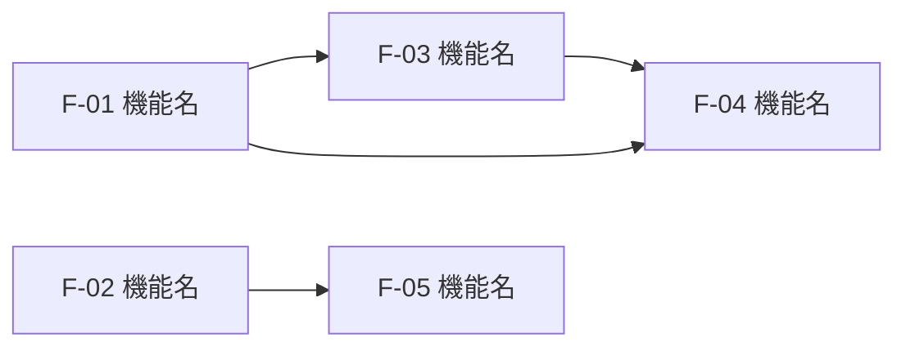

# 実装ロードマップ (Implementation Roadmap)

## このドキュメントについて

- プロダクト全体の実装順序を**機能レベル**で定義する全体地図
- 各行は `/add-feature` の実行単位（詳細タスクは実行時に `.steering/` に生成される）
- 機能の実装が完了したら状態を `[x]` に更新し、ステアリングへのリンクを記載する

## フェーズ概要

| フェーズ | ゴール | 状態 |
|---------|--------|------|
| Phase 1: MVP | [このフェーズ完了時に何ができるか1文で] | 未着手 |
| Phase 2: [名称] | [ゴール] | 未着手 |
| Phase 3: [名称] | [ゴール] | 未着手 |

## Phase 1: MVP

**ゴール**: [このフェーズ完了時に何ができるようになるか]

| 状態 | ID | 機能名 (`/add-feature` 単位) | 依存 | 関連設計 | ステアリング |
|------|----|------------------------------|------|----------|--------------|
| [ ] | F-01 | [機能名] | なし | [functional-design.md の該当節] | - |
| [ ] | F-02 | [機能名] | なし | [該当節] | - |
| [ ] | F-03 | [機能名] | F-01 | [該当節] | - |

## Phase 2: [名称]

**ゴール**: [ゴール]

| 状態 | ID | 機能名 (`/add-feature` 単位) | 依存 | 関連設計 | ステアリング |
|------|----|------------------------------|------|----------|--------------|
| [ ] | F-04 | [機能名] | F-01, F-03 | [該当節] | - |
| [ ] | F-05 | [機能名] | F-02 | [該当節] | - |

## 依存関係図



## 完了記録の書き方

実装完了時は該当行を次のように更新する:

```
| [x] | F-01 | ユーザー登録 | なし | 機能設計書 3.1 | [.steering/20260710-user-registration/](../.steering/20260710-user-registration/) |
```

## 変更履歴

| 日付 | 変更内容 |
|------|---------|
| YYYY-MM-DD | 初版作成 |
